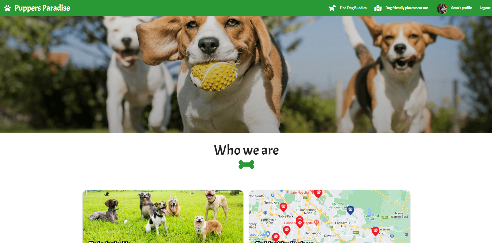

# Puppers paradise [](https://opensource.org/licenses/MIT)

## Description
A dog friendly app. Keep your dog nice and social. No need to consider buying another dog or multitasking between multiple sites. Finding a dog buddy and dog friendly places near you has never been easier.

Features listed below:
- Find other dog buddies around your area. Currently only shows all users. May not be in your area

- See dog friendly places near your location. Currently only displays dog parks

## Table of Contents
- [Installation](#installation)

- [License](#license)

- [Technologies](#technologies)

Home Page


Your Profile


Find a dog buddie


Sign Up


Breed Autocomplete


## Technologies
- Materialize CSS
- SASS
- Font awesome
- React-google-maps/api (Google Maps API)
- Moment
- Multer
- The dog API (Get list of breeds)
- Express
- React
- Mongoose
- Bcrypt
- Graphql
- React-router-dom

## Installation
To install the necessary dependencies, run the following command:

```

npm i

```

## License
This project is licensed under the [MIT](https://opensource.org/licenses/MIT) license